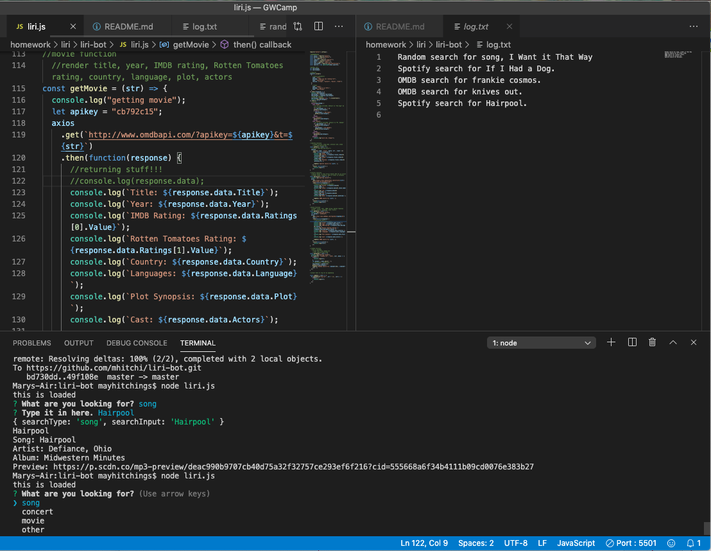
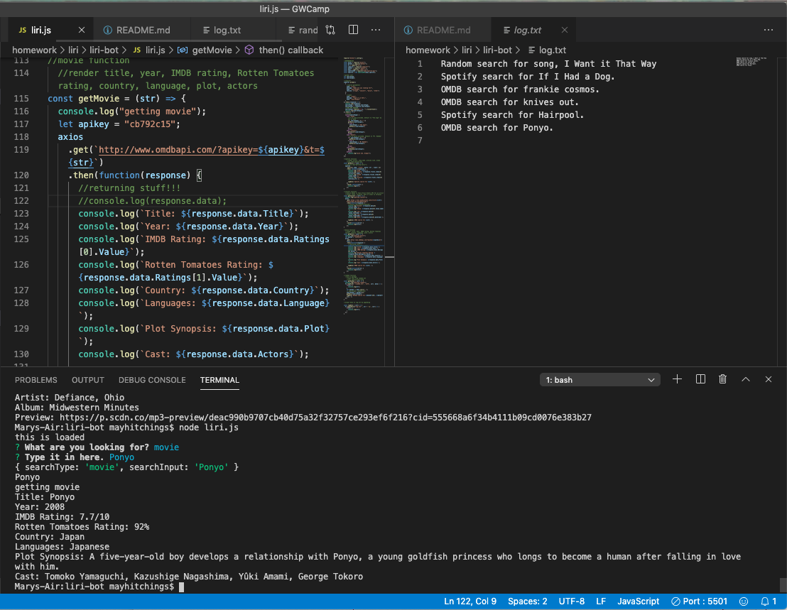

# liri-bot
Homework 9 part 2

Liri is a Language Interpretation and Recognition Interface that uses node to take in parameters, search Spotify, Bands in Town, and OMDB, and return data.

## User Story
As a cultured individual

I want to search for movies, songs, and concerts

So that I can learn more about them.

## User Experience

After calling 'node liri.js' in their terminal, the user is prompted first to pick what kind of search they are performing from a supplied list, then to enter the title of the movie or song or the name of the artist they're interested in. The app then runs the corresponding function and returns information while logging the search type and search terms to a log.

## Technology used

This app has several dependencies including the Node-Spotify-API, the OMDB API, the Bands in Town API, axios (to run the OMDB and Bands in Town calls), dot env, moment, fs (to write the log file), and inquirer (to ask the user questions).

## Requirements

gif or video in README.md
link to repo
link to updated portfolio in repo
